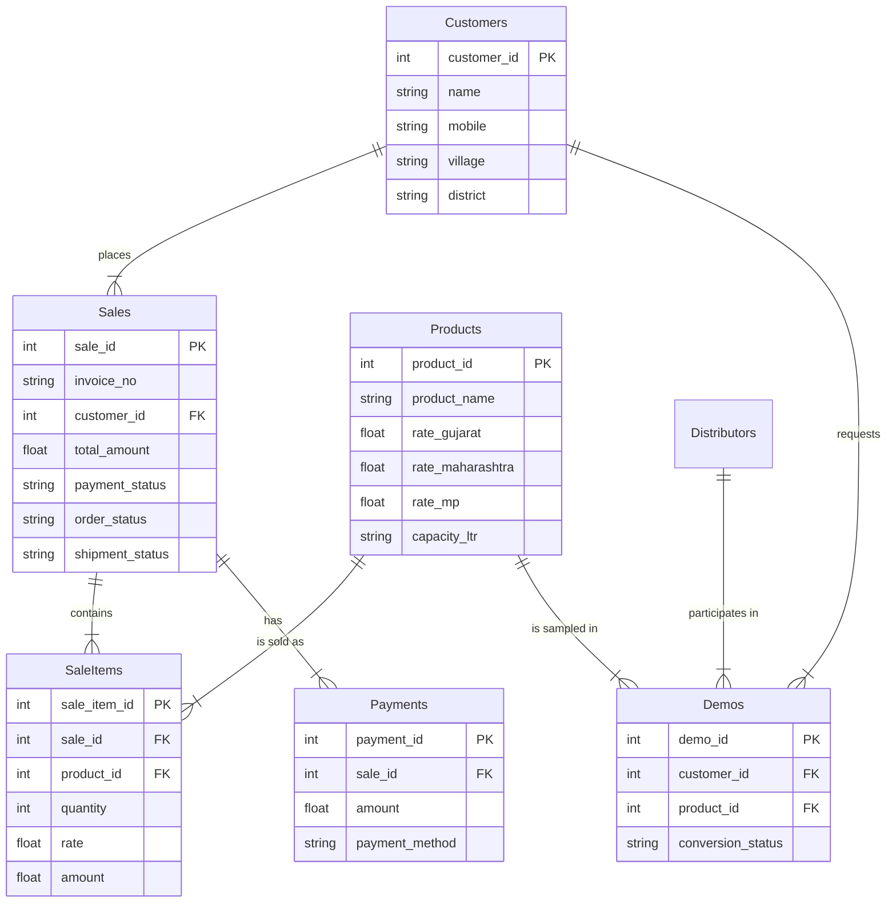

# Database Schema & Architecture

The database is hosted on **Supabase** (PostgreSQL). Below is the schema representation and key relationships derived from the production database.

## Entity Relationship Diagram

## Table Responsibilities

### Core Transactional Data
- **`sales`**: The central table for all revenue-generating transactions.
- **`sale_items`**: Granular line items for each sale. Links products to sales at a specific historical rate.
- **`payments`**: Ledger of all incoming money. One sale can have multiple partial payments.

### Master Data
- **`customers`**: The end-users (Farmers/Buyers).
- **`products`**: Catalog of items with **region-specific pricing columns** (`rate_gujarat`, `rate_mp`, `rate_maharashtra`).
- **`distributors`**: Groups or cooperatives that manage multiple customers.

### Operational Data
- **`demos`**: Pre-sales marketing activity. Tracks where free samples went and if they converted.
- **`activity_logs`**: Audit trail of who did what (security & debugging).
- **`notifications`**: System alerts for users.
