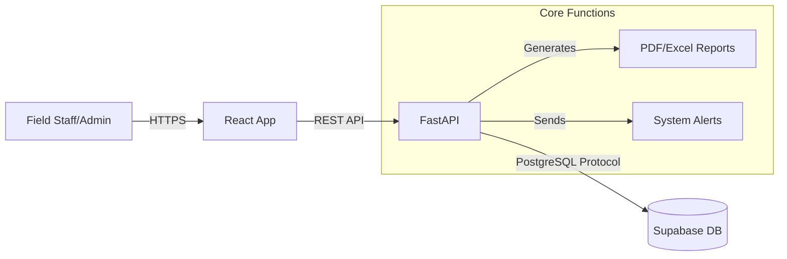

# Parul Chemicals Sales Platform

**Last Updated:** January 26, 2026

The **PC Sales Platform** is a B2B CRM and Inventory Management system designed for Parul Chemicals. It serves as the central system of record for field marketing (Demos), order fulfillment (Sales), and financial reconciliation (Payments).

---

## Quick Links

| Resource | URL | Description |
| :--- | :--- | :--- |
| **Source Code** | [yashdave182/pc_sales](https://github.com/yashdave182/pc_sales) | GitHub Repository |
| **Backend API** | [pc-sales-8phu.onrender.com](https://pc-sales-8phu.onrender.com/) | Live API & Swagger docs |
| **Frontend** | [pc-sales.vercel.app](https://pc-sales.vercel.app) | Production Web App |

---

## System Overview

The system architecture facilitates interaction between field staff and central administration through a React-based frontend and a Python FastAPI backend.

### Core Functional Areas

The application is divided into three primary domains:

1.  **Sales Management**:
    *   End-to-end order tracking from creation to delivery.
    *   Automated calculation of totals based on regional pricing rules.
    *   Inventory deduction logic (tied to `total_liters`).

2.  **Marketing (Demos)**:
    *   Tracking of sample products distributed to potential customers.
    *   Conversion funnel tracking (`Scheduled` → `Follow-up` → `Converted`).
    *   Automated linkage: Creating a Sale for a customer auto-converts their pending Demos.

3.  **Financial Reconciliation**:
    *   Many-to-one relationship between **Payments** and **Sales**.
    *   Ledger-based view of outstanding balances per customer.

---

## Technology Stack

| Component | Technology | Version | Key Libraries |
| :--- | :--- | :--- | :--- |
| **Frontend** | React | 18+ | Vite, TailwindCSS, Axios |
| **Backend** | Python | 3.12 | FastAPI, Pydantic, Supabase-py |
| **Database** | PostgreSQL | 15+ | Supabase (Hosted) |
| **Hosting** | Vercel (FE) / Render (BE) | - | - |

---

## Documentation Navigation

*   **API Reference**: Detailed list of system endpoints [View Reference](reference/api.md).
*   **Concepts**: Definitions of business entities [View Concepts](concepts.md).
*   **Architecture**: High-level design and modules [View Architecture](architecture/overview.md).
*   **Developer Guides**: Setup and extension tutorials [View Guides](guides/setup.md).
